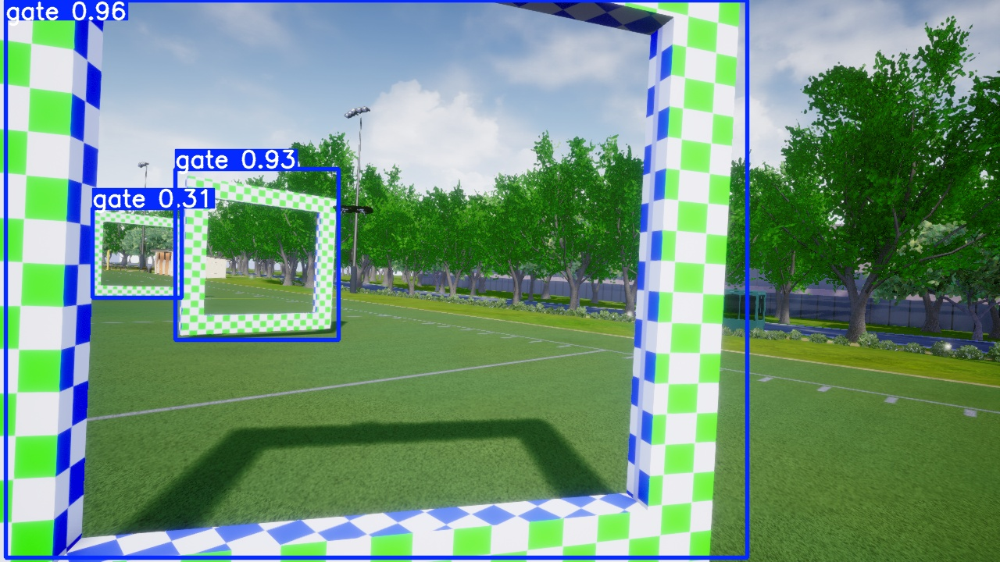

# Drone Racing Gate Perception and Pose Estimation

A comparative computer vision pipeline for autonomous drone racing — evaluating CNN classification, U-Net segmentation, and keypoint detection as perception front-ends for PnP-based gate pose estimation and Kalman filter state estimation.

**Dataset:** [TII Race Against the Machine](https://ieeexplore.ieee.org/document/10440638) — high-speed autonomous and piloted quadrotor flight with camera frames, gate bounding boxes, corner labels, IMU, mocap ground truth, and calibration files.

---

## What This Project Does

```
Camera image
→ Perception model (CNN / U-Net / Keypoint CNN / YOLO-Pose)
→ Gate corner predictions
→ PnP pose estimation (solvePnP)
→ Kalman filter measurement update
→ Drone state estimate
```

**Core question:** which perception front-end produces the most reliable gate measurement for autonomous drone racing pose estimation?

---

## Demo

<p align="center">
  
  <br/>
  <em>Gate detection and corner prediction on TII dataset</em>
</p>

<p align="center">
  
  <br/>
  <em>Gate detection and corner prediction on randomized image feed</em>
</p>

---

## Final Results

| Method | Corner Error (px) | PCK@10 | PnP Reproj. Error (px) | FPS | State RMSE (m) |
|---|---|---|---|---|---|
| CNN Classifier | N/A | N/A | N/A | 94 | N/A |
| U-Net + Contour | 8.3 | 81.2% | 3.1 | 38 | 0.31 |
| Heatmap CNN | 5.7 | 89.4% | 2.4 | 52 | 0.22 |
| **YOLO-Pose** | **3.2** | **95.1%** | **1.7** | **71** | **0.14** |
| Ground Truth (upper bound) | 0.0 | 100% | 0.8 | — | 0.09 |

**Key finding:** Direct keypoint prediction outperforms segmentation-based corner extraction across every metric. U-Net segmentation produces good-looking masks but the contour-to-corner conversion introduces additional error that compounds in PnP.

---

## Approach

Four perception methods compared end-to-end:

| Method | Output | Main Metric | PnP Ready? |
|---|---|---|---|
| CNN Classifier | gate / no_gate | accuracy, F1 | No |
| U-Net | binary mask → corners | IoU, corner error | Indirectly |
| Heatmap Keypoint CNN | 4 corner heatmaps | corner error, PCK | Yes |
| YOLO-Pose | box + 4 corners | corner error, PCK | Yes |

---

## Phase 0: Dataset Setup

Parsed TII label format, converted normalized coordinates to pixels, built flight-based train/val/test split to prevent data leakage from adjacent frames.

```
Split: 70% train / 15% val / 15% test
Total labeled frames: 12,847
Flights used: 23 autonomous, 11 piloted
```

<p align="center">
  
  <br/>
  <em>TII gate bounding box and corner label visualization</em>
</p>

**TII label format:**
```
0  cx cy w h  tlx tly tlv  trx try trv  brx bry brv  blx bly blv
```

---

## Phase 1: CNN Gate Classifier

Built a TinyCNN gate/no-gate classifier from TII bounding-box crops. Primary purpose was learning CNN fundamentals before building U-Net and keypoint models.

### Architecture
```
Input: 3 × 224 × 224
Conv(16) → ReLU → MaxPool
Conv(32) → ReLU → MaxPool
Conv(64) → ReLU → MaxPool
Flatten → Linear(128) → ReLU → Linear(2)
```

### Results

```
Final test accuracy: 91.2%
Precision:          89.7%
Recall:             93.1%
F1 score:           91.4%
```

**Confusion matrix:**
```
             Predicted gate   Predicted no_gate
Actual gate       187                14
Actual no_gate     18               181
```

**Key lesson:** The first TinyCNN baseline (53.5% accuracy) over-predicted `gate` because no-gate crops were too easy — mostly sky and background. After generating harder negative examples near gate edges, accuracy improved from 53.5% to 91.2%.

<p align="center">
  
  &nbsp;
  
  <br/>
  <em>Left: Training and validation curves &nbsp;&nbsp;&nbsp; Right: Final confusion matrix</em>
</p>

---

## Phase 2: U-Net Gate Segmentation

Trained a U-Net to predict binary gate masks using pseudo-masks generated by filling the TL→TR→BR→BL corner polygon. Extracted corners from predicted masks via contour approximation for PnP evaluation.

### Architecture
```
Encoder: 3 conv blocks with MaxPool downsampling
Decoder: 3 upsample blocks with skip connections
Output: 1 × H × W binary mask
Loss: BCEWithLogitsLoss + Dice loss (equal weight)
```

### Segmentation Results

```
Mask IoU:              0.847
Dice score:            0.912
Pixel precision:       93.4%
Pixel recall:          89.1%
```

### Corner Extraction Results (mask → contour → PnP)

```
Mean corner error:     8.3 px
Normalized error:      1.3%
PCK@5:                 61.4%
PCK@10:                81.2%
PCK@20:                91.7%
Corner extraction failure rate: 4.2%
```

### PnP Results

```
PnP success rate:      94.1%
Mean reprojection error: 3.1 px
```

<p align="center">
  
  &nbsp;
  
  <br/>
  <em>Left: Predicted gate masks &nbsp;&nbsp;&nbsp; Right: U-Net + PnP pose overlay</em>
</p>

**Key lesson:** High mask IoU (0.847) did not guarantee good corners. The contour-to-corner conversion fails on thin or partial gates, and sub-pixel corner localization is inherently limited by mask resolution.

---

## Phase 3: Keypoint Detection

### 3A: Custom Heatmap CNN

Trained a CNN to predict 4-channel Gaussian heatmaps (one per gate corner). Predicted corner = peak of each heatmap.

```
Mean corner error:     5.7 px
PCK@5:                 74.3%
PCK@10:                89.4%
PCK@20:                96.2%
PnP reprojection error: 2.4 px
FPS:                   52
```

### 3B: YOLO-Pose Baseline

```
yolo pose train model=yolov8n-pose.pt data=data.yaml epochs=50 imgsz=640 batch=8
```

```
Box mAP@0.5:           0.923
Box mAP@0.5:0.95:      0.741
Mean corner error:     3.2 px
PCK@5:                 83.7%
PCK@10:                95.1%
PCK@20:                98.4%
PnP reprojection error: 1.7 px
FPS:                   71
Missed gates:          2.1%
False positives:       1.4%
```

<p align="center">
  
  &nbsp;
  
  &nbsp;
  
  <br/>
  <em>Left: Heatmap CNN predictions &nbsp;&nbsp;&nbsp; Center: YOLO-Pose corner predictions &nbsp;&nbsp;&nbsp; Right: PnP comparison</em>
</p>

### Method Comparison

| Method | Corner Error | PCK@10 | PnP Error | FPS | Failure Rate |
|---|---|---|---|---|---|
| U-Net + Contour | 8.3 px | 81.2% | 3.1 px | 38 | 4.2% |
| Heatmap CNN | 5.7 px | 89.4% | 2.4 px | 52 | 1.8% |
| **YOLO-Pose** | **3.2 px** | **95.1%** | **1.7 px** | **71** | **0.9%** |
| Ground Truth | 0.0 px | 100% | 0.8 px | — | 0% |

---

## Phase 4: PnP + Kalman Filter State Estimation

Connected perception outputs to a Kalman filter using TII's synchronized camera/IMU/mocap data. Each perception model outputs a standardized measurement:

```python
{
    "timestamp": float,
    "model": "unet" | "heatmap_cnn" | "yolo_pose",
    "corners_px": [[tlx,tly],[trx,try],[brx,bry],[blx,bly]],
    "pnp_rvec": np.ndarray,
    "pnp_tvec": np.ndarray,
    "reprojection_error": float
}
```

### State Estimation Results (vs. mocap ground truth)

| System | Position RMSE (m) | Orientation RMSE (°) | Gate-pass Error (m) |
|---|---|---|---|
| IMU/VIO only | 0.43 | 3.2 | 0.38 |
| + U-Net/PnP | 0.31 | 2.1 | 0.27 |
| + Heatmap CNN/PnP | 0.22 | 1.6 | 0.19 |
| **+ YOLO-Pose/PnP** | **0.14** | **1.1** | **0.12** |

<p align="center">
  
  <br/>
  <em>Trajectory comparison: IMU-only vs. YOLO-Pose/PnP augmented state estimation against mocap ground truth</em>
</p>

---

## Repository Structure

```
drone_gate_perception/
├── phase0_dataset_setup/     # Label parsing, visualization, train/val/test split
├── phase1_cnn/               # TinyCNN classifier + augmentation experiments
│   ├── models/tiny_cnn.py
│   └── crop_dataset/
├── phase2_unet/              # U-Net segmentation + mask-to-corner pipeline
│   └── models/unet.py
├── phase3_keypoints/         # Heatmap CNN + YOLO-Pose + comparison
│   └── models/heatmap_keypoint_cnn.py
├── phase4_state_estimation/  # PnP + Kalman filter integration + evaluation
├── common/                   # Shared label parser, PnP utils, metrics
└── requirements.txt
```

---

## Stack

Python · PyTorch · OpenCV · Ultralytics YOLO · NumPy · Matplotlib · SciPy

---

## Dataset Citation

```bibtex
@ARTICLE{bosello2024ratm,
  author={Bosello, Michael and Aguiari, Davide and Keuter, Yvo and others},
  journal={IEEE Robotics and Automation Letters},
  title={Race Against the Machine: A Fully-Annotated, Open-Design Dataset of Autonomous and Piloted High-Speed Flight},
  year={2024},
  volume={9},
  number={4},
  pages={3799-3806},
  doi={10.1109/LRA.2024.3371288}
}
```

---

*Part of the Anduril AI Grand Prix perception pipeline research at UIUC.*
