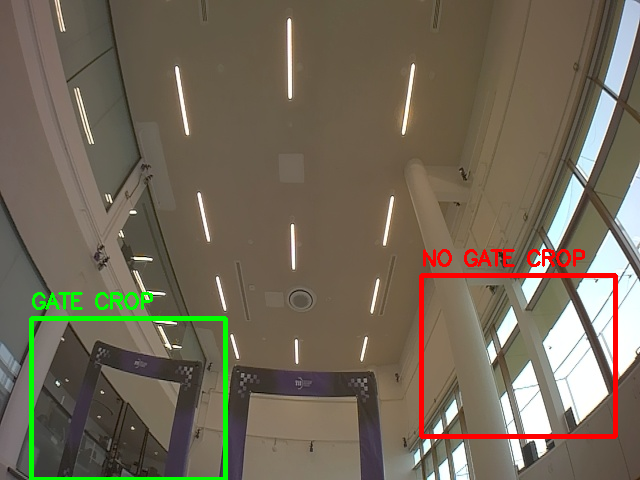

# Drone Racing Gate Perception and Pose Estimation

A comparative computer vision pipeline for autonomous drone racing — evaluating CNN classification, U-Net segmentation, and keypoint detection as perception front-ends for PnP-based gate pose estimation and Kalman filter state estimation.

**Dataset:** [TII Race Against the Machine](https://ieeexplore.ieee.org/document/10440638) — high-speed autonomous and piloted quadrotor flight with camera frames, gate bounding boxes, corner labels, IMU, mocap ground truth, and calibration files.

---

## What This Project Does

```
Camera image
→ Perception model (CNN / U-Net / Keypoint CNN / YOLO-Pose)
→ Gate corner predictions
→ PnP pose estimation (solvePnP)
→ Kalman filter measurement update
→ Drone state estimate
```

The core question: **which perception front-end produces the most useful gate measurement for autonomous drone racing?**

---

## Demo

<!-- Row 1: Main demo -->
<p align="center">
  
  <br/>
  <em>Gate detection and corner prediction on TII dataset</em>
</p>

---

## Approach

Four perception methods are compared end-to-end:

| Method | Output | Main Metric | PnP Ready? |
|---|---|---|---|
| CNN Classifier | gate / no_gate | accuracy, F1 | No |
| U-Net | binary mask | IoU, Dice | Indirectly |
| Heatmap Keypoint CNN | 4 corner heatmaps | corner error, PCK | Yes |
| YOLO-Pose | box + 4 corners | corner error, PCK | Yes |

**Phase structure:**

- **Phase 0** — Dataset parsing, label visualization, coordinate conversion
- **Phase 1** — TinyCNN gate/no-gate classifier (baseline)
- **Phase 2** — U-Net segmentation + mask-to-corner extraction
- **Phase 3** — Custom heatmap CNN + YOLO-Pose keypoint detection
- **Phase 4** — PnP pose estimation + Kalman filter state estimation evaluation

---

## Current Status

**Phase 1 complete. Phase 2-4 in progress.**

### Phase 1 Results — TinyCNN Baseline

```
Test accuracy: 53.5%

Confusion matrix:
[[100   0]
 [ 93   7]]
```

The first TinyCNN baseline over-predicts `gate` — a useful first failure mode that points directly to the next fix: better no-gate sampling and data augmentation.

---

## Key Technical Details

**Dataset label format (TII):**
```
0  cx cy w h  tlx tly tlv  trx try trv  brx bry brv  blx bly blv
```
All coordinates are normalized. Pixel conversion: `x_pixel = x_norm * image_width`

**PnP pipeline:**
```
predicted 2D corners + known 3D gate geometry + camera intrinsics
→ cv2.solvePnP
→ rvec, tvec, reprojection error
```

**State estimation evaluation:**
```
IMU/VIO only  vs  IMU/VIO + [perception model]/PnP
Metrics: position RMSE, orientation RMSE, drift, gate-pass localization error
```

---

## Repository Structure

```
drone_gate_perception/
├── phase0_dataset_setup/     # Label parsing and visualization
├── phase1_cnn/               # TinyCNN classifier
│   ├── models/tiny_cnn.py
│   └── crop_dataset/         # gate / no_gate crops
├── phase2_unet/              # Segmentation pipeline
│   └── models/unet.py
├── phase3_keypoints/         # Heatmap CNN + YOLO-Pose
│   └── models/heatmap_keypoint_cnn.py
├── phase4_state_estimation/  # PnP + Kalman filter integration
└── common/                   # Shared label parsing, PnP utils, metrics
```

---

## Stack

Python · PyTorch · OpenCV · Ultralytics YOLO · NumPy · Matplotlib

---

## Dataset Citation

```bibtex
@ARTICLE{bosello2024ratm,
  author={Bosello, Michael and Aguiari, Davide and Keuter, Yvo and others},
  journal={IEEE Robotics and Automation Letters},
  title={Race Against the Machine: A Fully-Annotated, Open-Design Dataset of Autonomous and Piloted High-Speed Flight},
  year={2024},
  volume={9},
  number={4},
  pages={3799-3806},
  doi={10.1109/LRA.2024.3371288}
}
```

---

*Part of ongoing research in autonomous drone racing perception at UIUC.*
